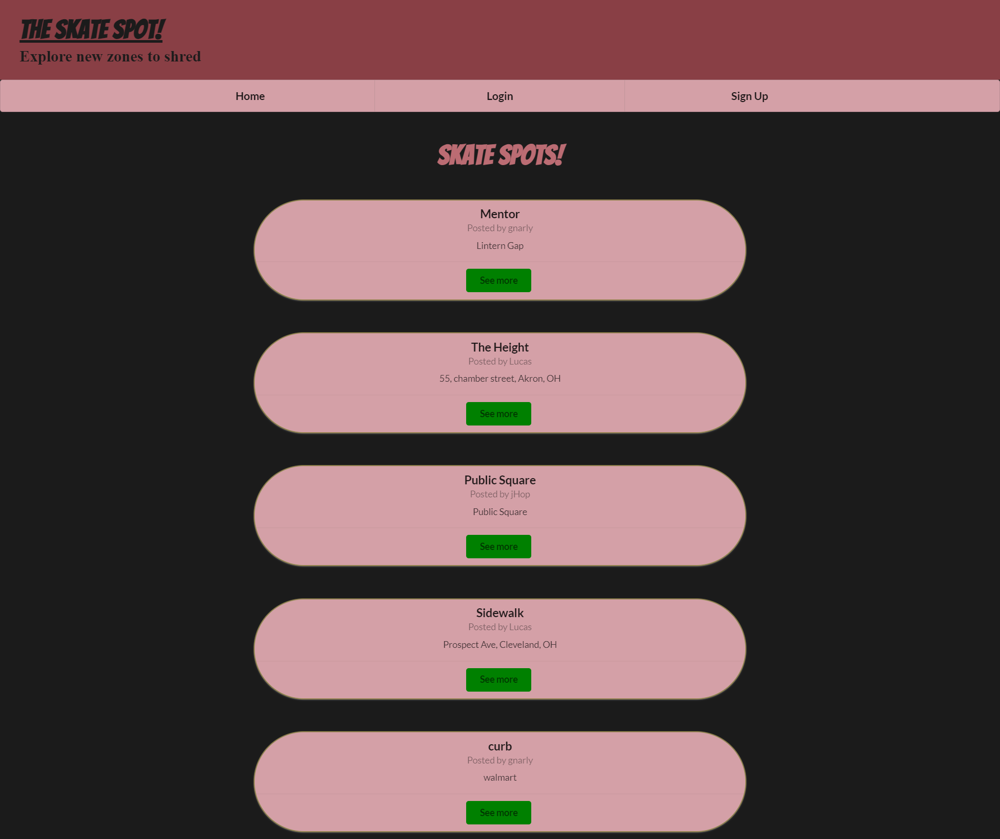

# SkateSpotter

## Description

Contributors: Reed Martin, Zach Zurawski, Lucas Bielinski, and Jeremy Hopkins

A message board-style application for skaters, for the purpose of discovering and sharing locations that have something for those who skate.

Not limited to strictly skateboards, SkateSpotter enables a network of enthusiasts to share locations that have unique surfaces, potential trick surfaces, or "situational awareness" commentary. These locations can include:

- Unique features like rails or ramps.
- Public skate parks.
- How adequate the lighting is.
- Grading the security presence there might be.
- Location address for independent searching (sorry, no map functions yet).
- And more!

Future plans include potential monetization via ads or placed sponsorships, potential photos of the locations (especially helpful if the address is not known), commentary on others' offered locations, and recommended skill levels.

This has been created by several skating enthusiasts, with an eye towards what skaters want.

Please note: you will need to create an account to use this app, but it is recommended to use your handle instead of name.

## Installation

In order to run on local please install, React, express, apollo-server-express, node, bcrypt, dotenv, graphql, jsonwebtoken, mongoose, nodemon,and babel.

## Usage

Signup and create a skate spot. If you would like to see a single skate spot, click on "see more". To delete a skate spot, go to your profile and delete click "break". Click on the logout button to logout.

https://skatespotter.herokuapp.com/

## Credits

N/A

## License

N/A
